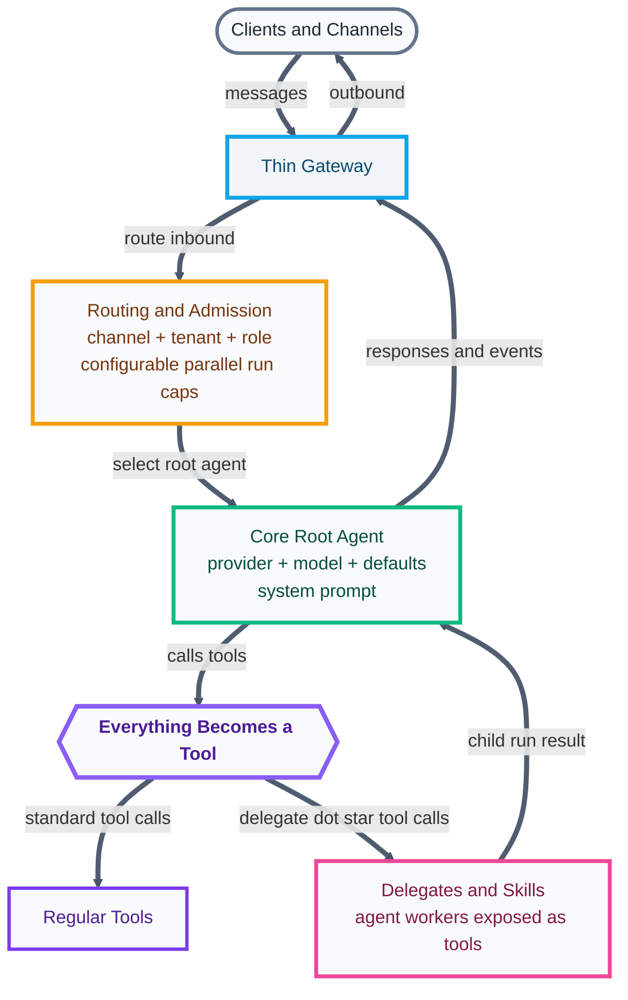
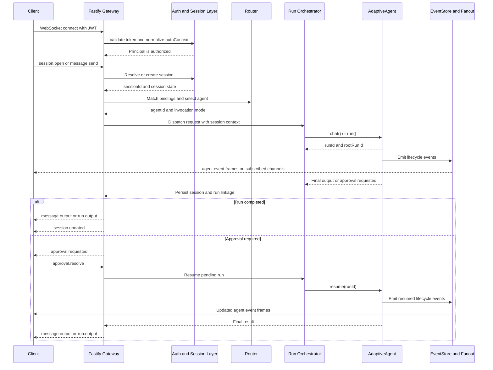

# AdaptiveAgent Gateway Diagrams

These diagrams are derived from [adaptive-agent-gateway-proposal.md](file:///Users/ugmurthy/riding-amp/AgentSmith/adaptive-agent-gateway-proposal.md) and are intentionally presentation-oriented.

## 0. Executive View: Thin Gateway, Tool-Centric Core

**Caption:** The gateway only routes and admits work; the core runs the selected root agent; delegates and skills are folded into the same tool interface.



### Core Idea

The central idea in `@adaptive-agent/core` is that the root agent works through a single execution model: it calls tools. Some of those tools are ordinary tools. Some of those tools are synthetic `delegate.*` tools that spawn child runs. Skills are first converted into delegates, so they also enter the runtime through the same tool path.

### Why This Matters

- The gateway stays thin. It mainly accepts messages, routes by channel, tenant, and role, and enforces configurable parallel run limits.
- The core stays simple. The root agent does not need separate orchestration logic for tools, delegates, and skills.
- Control stays uniform. Logging, events, approvals, snapshots, and run tracking can all flow through the same tool execution machinery.
- Composition stays easy. A new delegate or skill can be added without inventing a new runtime primitive.

## 1. High-Level Architecture

```mermaid
flowchart LR
    Client[Authenticated WebSocket Clients]

    subgraph Gateway[AdaptiveAgent Gateway]
        WS[Fastify WebSocket Server]
        Auth[Auth and Session Layer]
        Route[Deterministic Router]
        Orchestrator[Run Orchestrator]
        Fanout[Event Fanout]
    end

    subgraph Config[Configuration and Extensions]
        GatewayConfig[gateway.json]
        AgentConfig[agent configs]
        Modules[hooks, tools, auth modules]
    end

    subgraph Runtime[@adaptive-agent/core]
        Agent[AdaptiveAgent]
        Runs[Root Runs and Child Runs]
        Events[EventStore]
    end

    subgraph Storage[Persistence]
        SessionStore[Gateway session and transcript store]
        RunStore[Runtime run store]
    end

    Client -->|connect and send frames| WS
    WS --> Auth
    Auth -->|resolve or create session| Route
    Route -->|select configured agent| Orchestrator
    GatewayConfig --> Route
    AgentConfig --> Orchestrator
    Modules --> Orchestrator
    Orchestrator -->|chat(), run(), resume()| Agent
    Agent --> Runs
    Agent --> Events
    Auth --> SessionStore
    Orchestrator --> SessionStore
    Runs --> RunStore
    Events --> Fanout
    Fanout -->|session, run, root-run, agent channels| Client
```

## 2. Runtime Sequence


